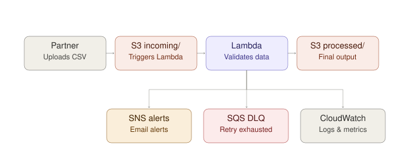

# serverless-data-processing-pipeline
A serverless AWS pipeline that ingests files, validates their structure and content, transforms the data efficiently, stores validated outputs, and reports success or failure.

## Table of Contents
- [Problem](#problem)
- [Requirements](#requirements)
- [Dataset](#dataset)
- [Architecture](#architecture)
- [Technical Decisions](#technical-decisions)
- [Setup](#setup)
- [Testing](#testing)
- [Results](#results)
- [Limitations](#limitations)
- [Future Improvements](#future-improvements)

## Problem

A business receives daily transaction files from an external partner. A manual or batch-scheduled process for this is slow to react, hard to monitor, and difficult to troubleshoot when something goes wrong. This project builds an event-driven, serverless alternative: files are picked up the moment they land, validated against both structural and business rules, transformed, and the outcome (success or failure, and why) is made visible automatically — with no fixed schedule to wait on and no manual step required to start processing.

## Requirements

Built to a project brief specifying:
- Event-driven ingestion (an S3 upload triggers processing — no polling, no schedule)
- Schema and business-rule validation, including duplicate and cross-row checks
- Infrastructure entirely as code (Terraform), never manually created in the console
- Automated tests, run in CI on every push/pull request
- Explicit failure handling, separate from ordinary data-quality rejections
- A Pandas vs. Polars performance comparison, with documented methodology

## Dataset

### Transaction Schema

| Field | Type | Description |
|---|---|---|
| `transaction_id` | string | Unique identifier per row (e.g. `TXN-00001234`) |
| `partner_batch_id` | string | Identifies which simulated daily file the row came from (e.g. `BATCH-2026-08-17`) |
| `account_id` | string | Simulated customer/account reference |
| `transaction_date` | date | Date the transaction occurred |
| `posted_date` | date | Date the transaction settled (should be >= `transaction_date`) |
| `transaction_type` | enum | One of: `purchase`, `refund`, `transfer`, `adjustment`, `fee` |
| `amount` | decimal | Signed amount — negative for refunds/adjustments, positive for purchases |
| `currency` | enum | One of: `USD`, `CAD`, `EUR` |
| `status` | enum | One of: `completed`, `pending`, `failed`, `reversed` |
| `merchant_name` | string | Merchant/vendor name, drawn from a fixed pool |
| `related_transaction_id` | string (nullable) | Populated only for refunds; should reference a valid `transaction_id` |
| `source_system` | string | Upstream system the partner pulled the record from |

### Seeded Defect Taxonomy

| Defect | Field(s) Involved | Description | Severity |
|---|---|---|---|
| Missing required field | `account_id`, `amount`, `transaction_date` | One of these core fields is null/blank | Critical |
| Duplicate transaction | `transaction_id` | Same ID appears more than once, possibly across two `partner_batch_id`s | Critical |
| Invalid enum value | `status`, `currency` | Value falls outside the defined allowed set | Warning |
| Date logic violation | `transaction_date`, `posted_date` | `posted_date` precedes `transaction_date`, or `transaction_date` is in the future | Critical |
| Orphaned refund | `related_transaction_id` | Value doesn't match any real `transaction_id` in the file | Critical |
| Amount sign mismatch | `amount`, `transaction_type` | Positive amount on a `refund`, or negative amount on a `purchase` | Warning |
| Status/amount inconsistency | `status`, `amount` | `status` is `failed` but `amount` is nonzero | Warning |
| Zero-value transaction | `amount` | `amount` equals `0.00` | Warning |

### Generation

Two datasets, generated from the same shared code so they can never drift out of structural sync:

- **Seeded dataset** (`data/sample/seeded_transactions.csv` + `data/sample/seeded_defect_manifest.json`) — a small, realistic-sized file standing in for a single daily partner drop. A known set of rows have intentionally injected defects (from the taxonomy above), and a JSON manifest records exactly which `transaction_id` got which defect and severity. This is the ground truth the validation logic and tests are checked against.
- **Benchmark datasets** (`data/sample/benchmark_*.csv`, not committed — see `.gitignore`) — large, essentially clean datasets that exist only to compare Pandas vs. Polars performance. Realism of individual rows matters far less here than volume and schema consistency.

**Source files (`src/`):**

| File | Purpose |
|---|---|
| `schema.py` | Single source of truth for field names, column order, and allowed enum values. Used by the dataset generator AND the deployed Lambda — see "Packaging" below. |
| `clean_record.py` | Generates one fully valid transaction row. Field generation is sequenced (type → amount sign/magnitude → status → dates) because later fields depend on earlier ones. Weighted distributions, not uniform randomness. |
| `defects.py` | Defect taxonomy implemented as a registry: each defect is a `(name, severity, mutation function)` entry rather than a hardcoded branch. |
| `generate_dataset.py` | CLI entry point. Builds a batch of clean rows, resolves refund linkage in a second pass, and either injects seeded defects or generates a large clean benchmark set. |

**Design decisions worth noting:**
- **`related_transaction_id` is resolved in a second pass, not inline.** A refund's `related_transaction_id` needs to reference a real `transaction_id` — but that ID may not exist yet if rows are generated one at a time. `generate_dataset.py` generates the full batch first, then resolves refund linkage against the completed pool.
- **Duplicate defects are appended, not overwritten.** Simulating a partner resending a row means the original row stays intact and a second copy is added — not a single row mutated in place.
- **A fixed random seed makes generation reproducible.** `--seed` pins Python's PRNG so re-running the generator produces the identical dataset every time.

## Architecture



*Top row: the main flow — a partner's daily upload triggers the Lambda, which writes validated output. Bottom row: the Lambda's three side effects — SNS alerts on rejections, the SQS dead-letter queue for genuine failures, and CloudWatch for execution logs. Every component shown is provisioned by Terraform, detailed below.*

All AWS resources are provisioned with Terraform — nothing is created manually in the console. The project uses a **shared remote state backend** (S3 + DynamoDB), provisioned once via a separate [`portfolio-shared-infra`](../portfolio-shared-infra) repository rather than duplicating a state bucket per project. See that repo's README for why the backend has to be bootstrapped separately. This project's own state is **entirely remote from the first `apply`** — the only exception anywhere in the portfolio is `portfolio-shared-infra` itself, which has to use local state since it's what creates the remote backend everything else depends on.

### Bucket Layout

One S3 bucket, three key prefixes (S3 has no real folders — these are prefixes on object keys):

| Prefix | Purpose |
|---|---|
| `incoming/` | Where a partner's daily CSV is dropped. Any `.csv` object created here triggers processing. |
| `processed/` | Successfully validated/transformed output, written per batch as `processed/{partner_batch_id}/transactions.csv` and `processed/{partner_batch_id}/summary.json`. Expires automatically after 90 days via a lifecycle rule. |
| `quarantine/` | Reserved for future use; not currently written to. Rejected files are deliberately left in place in `incoming/` rather than moved — see "Filename Validation" below. |

### Ingestion & Trigger

S3 invokes the Lambda directly on `s3:ObjectCreated:*` events, filtered to `incoming/` + `.csv` so it never fires on writes to `processed/`/`quarantine/` or on a stray non-CSV file. This keeps the trigger itself as simple as possible — SQS is used elsewhere (see "Failure Handling"), deliberately not as plumbing between S3 and Lambda.

### Processing

The Lambda handler (`src/lambda/handler.py`) runs, per incoming file: filename convention check → size check → staleness check → reprocessing check → read → validate → write. Each step is detailed under "Technical Decisions" below.

### IAM

- **Lambda execution role** — least-privilege: `s3:GetObject` scoped to `incoming/*`, `s3:PutObject` scoped to `processed/*` and `quarantine/*`, `s3:ListBucket` scoped to the bucket with a `Condition` restricting it to the `processed/` prefix (needed for reprocessing detection), `sns:Publish` scoped to one specific topic ARN, and `sqs:SendMessage` scoped to one specific queue ARN. No delete permission, no wildcard bucket or cross-service access.
- **`aws_lambda_permission` (S3 invoke permission)** — a separate resource-based policy from the execution role above, explicitly granting the S3 service principal permission to invoke this specific Lambda, scoped to this bucket's ARN. Easy to forget when wiring an S3→Lambda trigger manually — without it, the event notification silently does nothing.
- **Local development** uses a dedicated, scoped IAM user (not an admin/root account) for running Terraform.

### Failure Handling: SQS Dead-Letter Queue

Distinct from the SNS alerts described under "Technical Decisions," and worth being precise about the difference: SNS handles *expected, handled* problems (bad filename, oversized file) — the Lambda completes successfully and just chose to notify a human about the data. The SQS queue handles the opposite: genuine *unhandled exceptions* — the Lambda actually crashing.

This isn't the classic "Lambda polls SQS" pattern — S3 invokes this Lambda directly and asynchronously, so there's no queue in front of it to consume from. Instead, the queue is configured as the Lambda's **asynchronous invocation failure destination** (`aws_lambda_function_event_invoke_config`), a distinct AWS concept from SQS's own redrive-policy DLQs. AWS automatically retries a failed async invocation twice; only if both retries also fail does the event land in the queue, carrying the full original event plus AWS's own error message and stack trace. 14-day message retention (SQS's max, not its 4-day default) so a failure isn't silently lost over a long weekend.

**Verified against real AWS**, with a genuinely interesting nuance worth documenting rather than glossing over: manually invoking the Lambda asynchronously (`aws lambda invoke --invocation-type Event`) against a bucket/key that doesn't exist correctly triggered `RetriesExhausted` after 3 total attempts, and the failure landed in the queue as expected. The actual error, however, was `AccessDenied` on `s3:ListBucket`, not the `NoSuchKey` you might expect for a missing object. This is deliberate AWS behavior: `GetObject` on a nonexistent key returns `AccessDenied` rather than `NoSuchKey` when the caller lacks `ListBucket` permission on that bucket — S3 won't confirm or deny an object's existence to someone who isn't allowed to list the bucket's contents. The Lambda's role only has `ListBucket` scoped to `processed/*`, not `incoming/`, which is why this test's fake key produced this specific error. Not a gap worth fixing: in real operation, S3 only invokes this Lambda because a real object was just created, so this failure mode is purely an artifact of a deliberately fake test key.

### Packaging

`archive_file` builds the Lambda's zip from three individual files pulled from two different directories — `handler.py` and `validation.py` from `src/lambda/`, and `schema.py` from `src/` — rather than zipping one folder wholesale. This keeps `schema.py` a single source of truth shared by the dataset generator and the Lambda, with no duplicate copy maintained on disk. All three land flat at the zip's root, since Lambda unzips into one working directory and `import schema` expects to find it right there.

## Technical Decisions

### Filename Validation & Rejection Alerts

The handler's first check validates every incoming object key against a required naming convention before anything else happens:

```
transactions_{YYYY-MM-DD}_{partner_batch_id}.csv
```

- **Matches:** proceeds to size check, staleness check, reprocessing check, then real processing.
- **Doesn't match:** the handler publishes an alert to an SNS topic (`aws_sns_topic.rejected_files`) with the bucket and key, then returns. The file is **deliberately left untouched** in `incoming/` — no automatic quarantine copy or delete.

This is a scope decision, not an oversight: automated **detection**, human-driven **remediation**. A person receives the email alert and handles the file manually via the AWS Console. This sidesteps needing "safe move" logic (copy-then-delete-only-on-confirmed-success) inside the handler for a case that, in practice, needs a human decision anyway.

SNS email subscriptions require a one-time manual confirmation click (sent by AWS after `terraform apply`) before delivery starts — this can't be automated by design, since it's meant to prevent subscribing an address you don't own.

### File Size Limit

The object's size (read directly from the S3 event — no extra API call needed) is checked against `MAX_FILE_SIZE_MB` (default 25MB) before the file is ever read. An oversized file is rejected through the same alert path as a bad filename — an oversized file is itself an anomaly worth a human looking at, not a size Lambda should try to force through.

### Filename Date Staleness

Once a filename passes the convention check, its embedded date is compared against today's date. If it's more than 3 days in the past or future, the handler logs a `WARNING` — but this **does not block processing**. A backfilled or weekend-delayed file is a legitimate case, not a failure. This mirrors the critical/warning severity split already used in the dataset's defect taxonomy, just applied to the filename rather than row data.

### Reprocessing Detection

Output is written to `processed/{partner_batch_id}/`, keyed by the batch ID embedded in the filename — not a flat filename in `processed/`. This makes "has this batch already been processed" a cheap existence check (`s3:ListBucket` scoped to the `processed/` prefix, `MaxKeys=1`) rather than requiring a separate tracking mechanism.

If a file arrives for a batch that's already been processed, the handler logs a `WARNING`, publishes an SNS alert (reusing the rejection topic, distinct subject/message), and **still allows processing to proceed** — the write step overwrites the prior result, but never silently. This addresses the brief's "idempotency" stretch goal from a slightly different angle: not preventing duplicate processing outright, but ensuring any reprocessing is deliberate and auditable.

### Validation Logic (`src/lambda/validation.py`)

Two passes, run per row:

1. **Structural** — can the row even be evaluated? Required fields present, `amount` parses as a number, dates parse as real dates. Always critical; a row that fails structurally skips business-rule checks entirely.
2. **Business rule** — the remaining 7 checks from the defect taxonomy, run only against rows that passed structurally. Two of them (`duplicate_transaction`, `orphaned_refund`) need the whole batch — the validator does a first pass over every raw `transaction_id` in the file (including rows that failed structurally) before evaluating these, so a refund pointing at a real transaction isn't wrongly flagged just because that other row failed structural validation for an unrelated reason.

**Disposition:** any critical violation rejects the row. Warning-only violations still pass but are recorded in the exception detail too, not just counted. `zero_value_transaction` deliberately still fires even for `failed`-status rows where a zero amount is expected by design — the check stays generic rather than special-casing it.

### Reading & Writing (`src/lambda/handler.py`)

- **Reading:** the CSV is streamed line-by-line rather than loading the whole object into memory at once — keeps memory usage proportional to what's being processed, not the full file size.
- **Writing order is deliberate.** `transactions.csv` is written first, `summary.json` last. S3 writes aren't transactional, so the worst crash-mid-write outcome is a stale-but-present `summary.json` next to a newer `transactions.csv` — recoverable and detectable — rather than the reverse.
- **`transactions.csv` is always written, even if empty** (header-only, for an all-rejected batch) — a consistent output shape is easier to build downstream tooling against.

### Where Polars Fits (and Where It Doesn't)

The brief calls for Polars as the primary processing library, but Polars isn't part of AWS's standard Lambda Python runtime the way `boto3` is — packaging it requires either a Lambda Layer or a container image deployment, both meaningfully bigger infrastructure lifts than this project's scope calls for.

**Decision:** the deployed Lambda's actual transformation/validation logic stays plain Python (stdlib `csv`, no dependencies beyond `boto3`). Polars (and the Pandas comparison) is used specifically for the benchmark report, run as a **standalone local script** against three dataset sizes, entirely separate from the deployed Lambda.

## Setup

**1. Provision the shared state backend** (once, from [`portfolio-shared-infra`](../portfolio-shared-infra)):
```bash
cd portfolio-shared-infra && terraform init && terraform apply
```

**2. Set your notification email** (`terraform/terraform.tfvars`, gitignored):
```
notification_email = "you@example.com"
```

**3. Provision this project's infrastructure:**
```bash
cd terraform
terraform init
terraform plan
terraform apply
```
Confirm the SNS subscription email AWS sends after `apply` — delivery doesn't start until that link is clicked.

**4. Generate sample data:**
```bash
python src/generate_dataset.py --mode seeded --rows 2000 --defect-rate 0.05 --seed 42
```

**5. Upload a file to trigger the pipeline:**
```bash
aws s3 cp data/sample/seeded_transactions.csv \
  s3://<your-bucket-name>/incoming/transactions_$(date +%Y-%m-%d)_TESTBATCH.csv
```

### Running Code Locally

`src/lambda/validation.py` and `src/lambda/handler.py` import `schema.py` from `src/`, not `src/lambda/` — this works automatically once deployed (the Lambda's zip flattens all three into one directory, see "Packaging"), but running or testing this code locally requires telling Python to also look in `src/`:

```bash
PYTHONPATH=src python3 scripts/benchmark.py
```

Dev/benchmark dependencies (`pandas`, `polars`, `pytest`, `moto`) are in `requirements-dev.txt`, kept separate from `requirements.txt` (what the deployed Lambda actually needs — currently near-empty, since it only uses `boto3`, which ships with the Lambda runtime):

```bash
pip install -r requirements-dev.txt
```

## Testing

`tests/test_validation.py` covers `validation.py` directly — structural checks, each business rule (both triggering and not), the two file-level checks (including regression tests for two bugs found during manual testing — see below), and overall disposition/summary logic. Pure unit tests, no AWS dependency.

`tests/test_handler.py` covers `handler.py`'s full flow using `moto` to mock S3/SNS, rather than hand-rolled stubs. Covers filename rejection, oversized-file rejection, reprocessing detection, a full valid batch writing both output files with correct content, the empty-`transactions.csv` edge case, a UTF-8 decode failure being caught rather than crashing, and multiple S3 records in one event being processed independently.

**Bugs the test suite caught that manual testing had missed:** writing the test suite surfaced a real formatting regression — `valid_rows` was returning the *parsed* (typed) version of each row rather than the original raw strings, so `transactions.csv` was writing `25.0` instead of the source `"25.00"`. Fixed by keeping the original raw row alongside the parsed version through `validate_batch()`. This is on top of two file-level check bugs (orphan-refund cascading failures, duplicate violations being double-counted) found during earlier manual testing — a useful example of why a real test suite catches things ad hoc manual testing doesn't, even when that manual testing was done carefully against real data.

Run the full suite:
```bash
AWS_DEFAULT_REGION=us-east-1 PYTHONPATH=src python3 -m pytest tests/ -v
```
`AWS_DEFAULT_REGION` is required for `test_handler.py` — `handler.py`'s `boto3` clients rely on the execution environment to supply a region (correct behavior in real Lambda, where AWS injects it automatically), so a bare local/CI environment needs it set explicitly.

**CI:** the same suite runs automatically via GitHub Actions (`.github/workflows/ci.yml`) on every push/PR to `main`, alongside a `terraform fmt -check` + `terraform validate` job. CI deliberately holds no AWS credentials and never touches real state — it's a correctness gate on commits, not a deployment mechanism.

## Results

**Pipeline, verified against real AWS (not local mocks):**
- **S3 → Lambda trigger:** uploading a CSV to `incoming/` produces a CloudWatch Logs entry confirming the Lambda received the correct bucket/key, within milliseconds of the upload.
- **Filename validation, both branches:** an incorrectly-named file produced a `WARNING` log, an SNS publish, and a real email delivered to the subscribed address.
- **Staleness check:** a fresh filename produced no warning; a filename outside the 3-day threshold correctly logged a staleness `WARNING` without blocking processing.
- **Reprocessing detection:** re-uploading an already-processed batch ID correctly logged a warning and delivered a real "Reprocessing Detected" email.
- **End-to-end transformation:** uploading the real seeded dataset produced both `transactions.csv` and `summary.json` under `processed/{batch_id}/`, with counts and exception detail matching expectations.
- **DLQ:** a deliberately-triggered unhandled exception correctly landed in the SQS queue after AWS exhausted its 2 automatic retries, carrying the real error and stack trace.

**Benchmark (Pandas vs. Polars):** full methodology and results in **[`docs/benchmark_report.md`](docs/benchmark_report.md)**. Headline finding: Polars was 5-6x faster than Pandas across all three tested sizes (50K/500K/2M rows) — notably, the speed advantage was already present at the smallest size, not something that only appears past some threshold — but used 36-38% *more* peak memory at medium/large scale, which was the more genuinely surprising finding and is flagged in the report as not fully explained.

## Limitations

- Single-environment deployment (`dev` only) — no staging/prod separation exists yet.
- No automated deploy pipeline; `terraform apply` is run manually from a local machine using a personally-scoped IAM user.
- The benchmark report's memory-overhead finding is flagged as an open question, not a fully explained one — see `docs/benchmark_report.md`'s own Limitations section.
- Tested against synthetic data only; no real partner file has ever been processed by this pipeline.

## Future Improvements

- A separate, manually-gated deploy workflow (Terraform `apply` triggered by GitHub Actions with a required approval step) — deliberately out of scope for now, kept distinct from CI's job of validating correctness on every commit.
- Multi-environment support (`dev`/`staging`/`prod`), using the `environment` variable already threaded through resource naming but currently only ever set to `dev`.
- CloudWatch alarms on Lambda error rate and on `Invocations` being unexpectedly absent for an extended period (e.g. no files received in 6 months).
